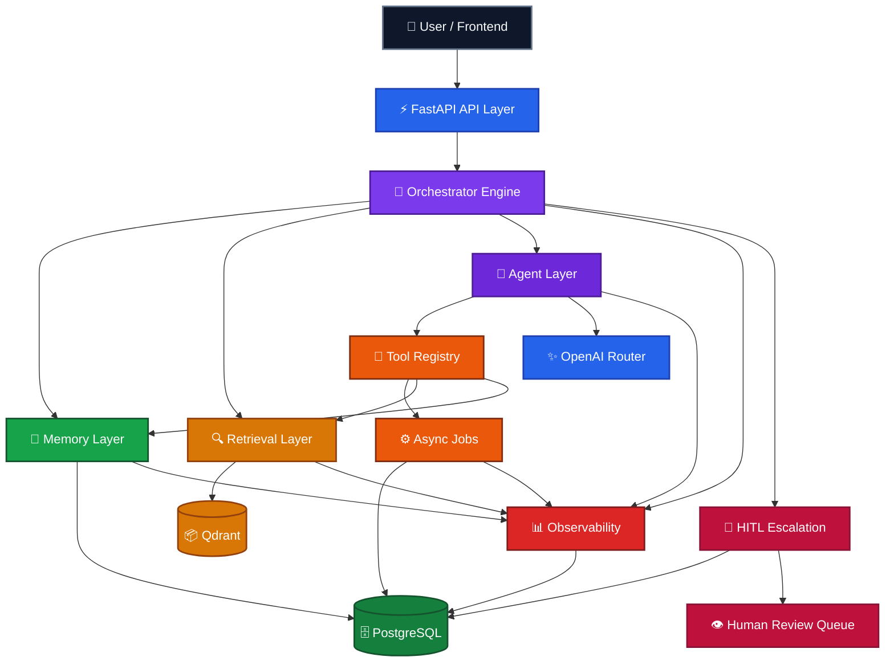

<div align="center">
  
</div>

<h1 align="center">Nexus AI</h1>

<h3 align="center">Multi-Agent RAG Orchestration Platform</h3>

<p align="center">
  Production-grade AI system with memory, retrieval, planning, observability, and human-in-the-loop workflows.
</p>

<br/>

<p align="center">
  
  &nbsp;
  
  &nbsp;
  
  &nbsp;
  
  &nbsp;
  
  &nbsp;
  
</p>

<p align="center">
  
  &nbsp;
  
  &nbsp;
  
  &nbsp;
  
</p>

---

## System Status

| Component | Status |
|:---|:---|
| Backend API | ✅ Ready |
| Orchestrator Engine | ✅ Active |
| Agent Layer (5 agents) | ✅ Active |
| Memory Layer | ✅ Enabled |
| Retrieval / Qdrant | ✅ Enabled |
| Async Job System | ✅ Enabled |
| HITL Escalation Workflow | ✅ Enabled |
| Observability + Tracing | ✅ Enabled |
| Auth & Role Protection | ✅ Enabled |
| CI / Docker Deployment | ✅ Ready |

---

## Overview

Nexus AI is a production-style AI orchestration platform — not a chatbot wrapper.

It combines a staged FastAPI orchestrator, persistent memory, Qdrant-backed vector retrieval, specialized agents, tool-assisted execution, background jobs, full observability, and a human-in-the-loop review workflow into a single backend-first operating layer for serious AI applications.

The project addresses a harder problem than "how do we chat with an LLM?" — it asks how to build an AI system that routes intelligently, stays grounded in retrieved context, remembers the right things, traces every execution stage, and safely escalates when confidence is low or risk is high.

---

## Why Nexus AI Is Different

| Feature | Why It Matters |
|:---|:---|
| Multi-agent orchestration | Specialized agents route, plan, research, summarize, and escalate — not a monolithic prompt |
| Tool execution layer | AI can act on context, not just respond to it |
| Persistent memory | Every conversation is context-aware with freshness scoring and summary reuse |
| Retrieval system | Answers are grounded in indexed knowledge with quality-scored context, not hallucinated |
| Multi-step planning | Complex requests expand into explainable, dependency-tracked execution plans |
| Full observability | Every request carries trace IDs, stage timings, enriched events, and audit logs |
| HITL workflow | Escalations become persistent review cases — not silent failures or transient signals |
| Auth & roles | Reviewer and admin roles protect sensitive APIs and the review dashboard |
| Evaluation suite | 18 deterministic benchmark cases validate orchestration behavior on every run |

---

## System Snapshot

<p align="center">
  
  &nbsp;
  
  &nbsp;
  
  &nbsp;
  
</p>

<p align="center">
  
  &nbsp;
  
  &nbsp;
  
  &nbsp;
  
</p>

---

## Latest Capabilities

### Multi-Agent Orchestration

Five specialized agents handle distinct execution roles: **support**, **research**, **planning**, **summarization**, and **escalation**. The orchestrator routes every request through the right agent path based on intent, context, and confidence signals.

### Intelligent Planning

The planner engine generates deterministic single-step or multi-step execution plans. Complex requests expand into chained steps with dependency tracking, context injection, tool recommendations, and skip logic. Simple requests stay lean.

### Context-Aware Memory

Every conversation builds a persistent memory layer with summary compression, freshness heuristics, and recent-turn prioritization. Memory informs retrieval decisions — stale context is flagged, fresh context is reused.

### Grounded Retrieval

Qdrant-backed vector search returns quality-scored context chunks. Retrieval quality signals (strong / weak / none) adjust response posture and memory-retrieval interaction dynamically. Weak retrieval triggers appropriate hedging.

### Human-in-the-Loop Escalation

Low-confidence or high-risk requests escalate into persistent HITL review cases. Reviewers can assign cases, add notes, change status, and close with audit trail — managed via a dedicated frontend dashboard.

### Full Observability

Every request carries a `trace_id`. Stage timings, enriched events, grounding signals, planning metadata, job status, and escalation activity are all logged and queryable through internal metrics and trace endpoints.

### Auth & Role-Based Access

Reviewer and admin roles protect escalation APIs and the reviewer dashboard. JWT-based authentication with role enforcement across all protected backend routes.

### Evaluation Suite

18 deterministic benchmark cases cover retrieval quality, memory quality, agent selection, and regression stability. The eval runner produces saved reports for CI visibility and continuous quality tracking.

---

## Core Features

### AI System

| Feature | Description |
|:---|:---|
| Multi-agent routing | Support, research, planner, summarizer, and escalation agent paths |
| Multi-step planning | Deterministic chaining, dependency tracking, skip logic, and context injection |
| Retrieval quality scoring | Strong / weak / none grounding signals with adaptive response posture |
| Memory freshness heuristics | Stale context flagging, summary reuse, recent-turn prioritization |
| HITL escalation | Persistent review cases with assignment, notes, status, and audit trail |
| Evaluation suite | 18 deterministic benchmark cases with saved run reports |

### Backend

| Feature | Description |
|:---|:---|
| Staged orchestrator | Isolated pipeline stages with shared execution context |
| Tool registry | Structured tool invocation for retrieval, memory, and escalation |
| Async job system | Background ingestion, memory summarization, analytics aggregation |
| Observability | Trace IDs, stage timings, enriched event log, and metrics endpoint |
| Auth & roles | JWT auth with reviewer and admin role enforcement |
| Health endpoints | Readiness and liveness checks for production deployment |

### Platform

| Feature | Description |
|:---|:---|
| Docker deployment | Compose-based deployment for development and production |
| CI pipeline | GitHub Actions for test and validation automation |
| Environment validation | Startup checks for required environment variables |
| Production Compose | Separate production override for hardened deployments |
| Reviewer dashboard | Next.js frontend with HITL case management and login flow |
| Eval runner | Standalone eval CLI with `--suite` selection and `--save-report` |

---

## Architecture

Nexus AI is organized around a backend-first orchestration core. The API receives requests, the orchestrator decides execution scope, agents and tools produce grounded output, background jobs handle longer-running work, observability captures the full trail, and escalated cases move into a persistent human review workflow.



---

## Tech Stack

### Frontend

| Technology | Purpose |
|:---|:---|
| Next.js 14 | App router, server components, reviewer dashboard UI |
| TypeScript | Type-safe frontend across components and API calls |
| Tailwind CSS | Utility-first styling for reviewer and chat interfaces |

### Backend

| Technology | Purpose |
|:---|:---|
| FastAPI | Async Python API framework with typed schemas and route groups |
| SQLAlchemy | ORM for conversations, events, jobs, escalation, and auth state |
| PostgreSQL | Primary persistence for all structured platform data |
| Alembic | Database migration management |
| PyJWT | JWT authentication for reviewer and admin role enforcement |

### AI / Data

| Technology | Purpose |
|:---|:---|
| OpenAI API | LLM inference for agent reasoning, planning, and summarization |
| Qdrant | Vector database for document indexing and retrieval |
| Embeddings | Dense vector representations for semantic retrieval scoring |
| Custom eval runner | Deterministic benchmark suite for orchestration regression testing |

---

## Development Progress

| Phase | Description | Status |
|:---:|:---|:---:|
| Phase 1 | Foundation — FastAPI scaffolding, project structure, base orchestrator | 🟢 Complete |
| Phase 2 | Database + RAG — PostgreSQL, Qdrant, ingestion, indexing, retrieval | 🟢 Complete |
| Phase 3 | Agents + LLM + Tools — multi-agent routing, LLM integration, tool execution | 🟢 Complete |
| Phase 4 | Async Jobs + Observability — background jobs, tracing, event logging, metrics | 🟢 Complete |
| Phase 5 | Planning + Intelligence — multi-step execution, smart planning, quality optimization | 🟢 Complete |
| Phase 6 | Production Features — HITL workflow, dashboard UI, auth and roles, eval suite | 🟢 Complete |
| Phase 7 | Deployment + Polish — Docker, CI/CD, environment validation, health endpoints | 🟢 Complete |

> ✅ All phases completed — Nexus AI is now a production-ready AI orchestration platform.

---

## Project Structure

```text
backend/
  app/              — FastAPI app, routes, services, orchestrator, agents, tools
  tests/            — 160+ backend tests (no live dependencies required)
  evals/            — Deterministic evaluation runner and benchmark cases
  evals_data/       — Benchmark input data
  eval_reports/     — Saved evaluation run outputs

frontend/
  app/              — Next.js app router pages
  components/       — UI components including reviewer dashboard
  lib/              — API client and utility modules
  types/            — Shared TypeScript types

docs/
  architecture.md
  api-contracts.md
  deployment.md
  dev-status.md

specs/
prompt_history/
.github/workflows/
docker-compose.yml
docker-compose.prod.yml
```

---

## Quick Start

### 1. Clone and configure

```bash
git clone <repo-url> nexus-ai
cd nexus-ai
cp backend/.env.example backend/.env
```

### 2. Install backend dependencies

```bash
cd backend
python -m venv .venv
.venv/Scripts/activate
pip install -r requirements.txt
```

### 3. Start infrastructure and backend

```bash
docker compose up -d
uvicorn app.main:app --reload --port 8000
```

Development seeded accounts:

| Role | Email | Password |
|:---|:---|:---|
| Reviewer | `reviewer@nexus.local` | `ReviewerPass123!` |
| Admin | `admin@nexus.local` | `AdminPass123!` |

### 4. Start the frontend

```bash
cd ../frontend
npm install
cp .env.local.example .env.local
npm run dev
```

Set `NEXT_PUBLIC_API_BASE_URL` in `frontend/.env.local` if your backend is not on `http://localhost:8000`.

### 5. Verify the platform

```bash
curl http://localhost:8000/api/v1/health
```

Open `http://localhost:3000/login` to access the reviewer dashboard.

---

## Testing

The backend test suite runs without live OpenAI, Qdrant, or PostgreSQL dependencies.

```bash
cd backend
pytest tests -q
```

- `160+` backend tests passing
- Coverage across orchestration, planning, retrieval quality, memory freshness, agents, tools, jobs, observability, and escalation workflow
- In-memory and mocked paths for fast, deterministic CI execution

---

## Evaluation Suite

```bash
cd backend
.venv/Scripts/python.exe -m app.evals.runner --suite all --save-report
```

- `18 / 18` evaluation benchmark cases passing
- Covers retrieval quality, memory quality, agent selection, and regression stability
- Reports saved to `backend/eval_reports/`

---

## Deployment

### Development

```bash
docker compose up --build
```

### Production

```bash
docker compose -f docker-compose.yml -f docker-compose.prod.yml up --build -d
```

For environment setup, cloud guidance, and production configuration see [docs/deployment.md](docs/deployment.md).

---

## Roadmap

- Reviewer dashboard refinement and richer HITL workflows
- Deeper planning and autonomous execution strategies
- Expanded evaluation coverage and CI quality gates
- Scaled deployment patterns and infrastructure hardening

For the latest implementation snapshot see [docs/dev-status.md](docs/dev-status.md).

---

## Documentation

| Resource | Description |
|:---|:---|
| [backend/README.md](backend/README.md) | Backend setup, environment variables, API groups, test commands |
| [docs/architecture.md](docs/architecture.md) | Detailed architecture decisions |
| [docs/api-contracts.md](docs/api-contracts.md) | API schema and contract reference |
| [docs/deployment.md](docs/deployment.md) | Deployment and production configuration |
| [docs/dev-status.md](docs/dev-status.md) | Current implementation snapshot |

---

<p align="center">
  Built by <strong>Zohair Azmat</strong> &nbsp;·&nbsp; AI Engineer | Full Stack Developer
</p>

## License

MIT
