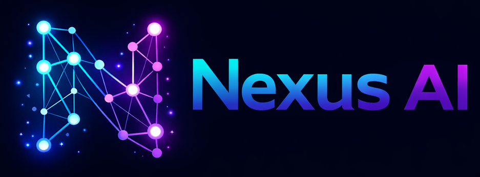
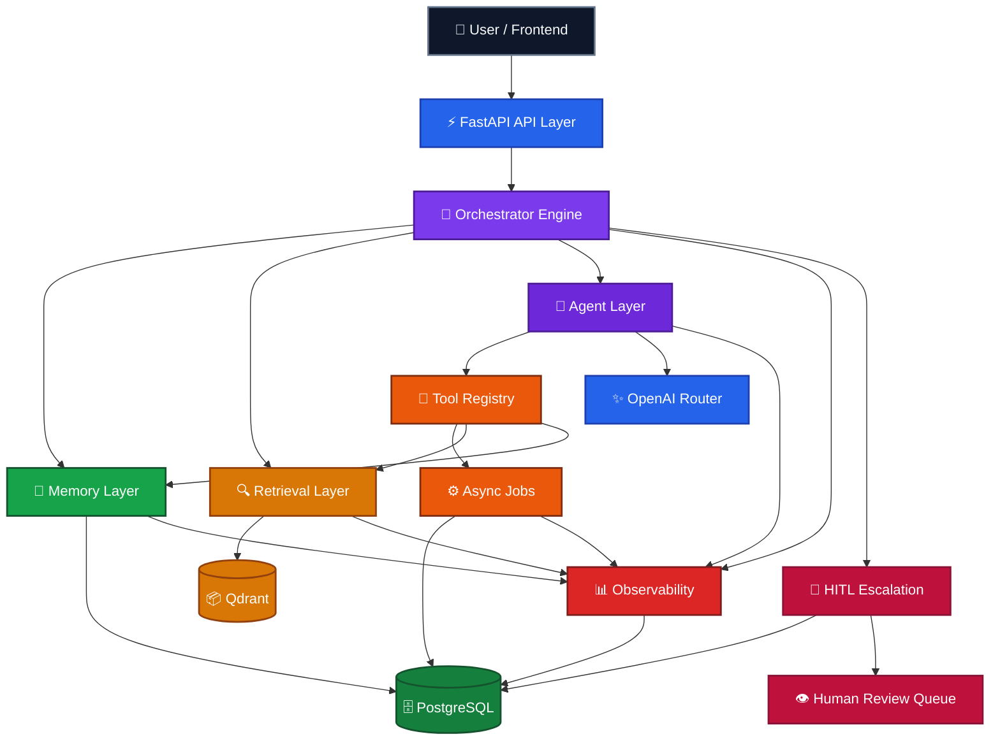

<p align="center">
  
</p>

<h1 align="center">Nexus AI</h1>

<p align="center">
  <strong>By Zohair Azmat</strong> &nbsp;·&nbsp; AI Engineer | Full Stack Developer
</p>

<p align="center">
  <em>Multi-Agent RAG Orchestration Platform</em>
</p>

<p align="center">
  <strong>From Retrieval to Reasoning to Action — A Full AI Orchestration System</strong>
</p>

<br/>

<p align="center">
  
  
  
  
</p>

<p align="center">
  
  
  
  
  
  
</p>

<br/>

---

## Overview

Nexus AI is a production-style AI orchestration platform — not a chatbot wrapper.

It combines a staged FastAPI orchestrator, persistent memory, vector retrieval, specialized agents, tool-assisted execution, background jobs, observability, and a human-in-the-loop review workflow into a single backend-first operating layer for serious AI applications.

The project answers a harder question than "how do we chat with an LLM?" It asks: how do you build an AI system that routes intelligently, stays grounded, remembers the right things, traces every execution stage, and hands off to humans when risk is high?

---

## Why Nexus AI Is Different

- **Not a wrapper.** Full orchestration engine with staged pipeline execution.
- **Retrieval + Memory + Agents.** All three layers work together in one runtime path.
- **Production-grade visibility.** Traces, metrics, enriched events, and stage timings are built into the core execution path — not bolted on.
- **Real HITL.** Human-in-the-loop escalation creates persistent review cases, not transient runtime signals.
- **Built to evolve.** Structured from the start to scale from assistant workflows toward more autonomous AI operating systems.

---

## System Snapshot

| Metric | Value |
|:---|:---|
| Backend Tests Passing | `160+` |
| Evaluation Cases | `18 / 18` passing |
| Phases Completed | `7 / 7` |
| Active Specialized Agents | `5` |
| Execution Model | Single-step + Multi-step planning |
| Memory Layer | Persistent conversations + summaries + freshness heuristics |
| Retrieval Stack | Qdrant vector search + embeddings + quality scoring |
| HITL Workflow | Enabled — persistent review cases, assignment, notes, audit trail |
| Observability | Trace IDs + stage timings + enriched event log + metrics endpoint |
| Auth & Roles | Reviewer and admin roles with protected APIs and login UI |

---

## System Capabilities

| Capability | What It Enables |
|:---|:---|
| **Retrieval (RAG)** | Grounded answers using indexed knowledge and quality-scored context |
| **Memory** | Persistent conversations, summaries, freshness heuristics, context reuse |
| **Multi-Agent Routing** | Support, research, planner, summarizer, and escalation agent paths |
| **Tool Execution** | Structured tool invocation for context lookup, retrieval, and escalation |
| **Async Jobs** | Background ingestion, summary generation, and analytics aggregation |
| **Observability** | Trace IDs, metrics, stage timings, event logs, and auditability |
| **HITL Escalation** | Persistent review cases, assignment, notes, status changes, and reviewer UI |
| **Auth & Roles** | Protected reviewer APIs with role-based access control |

---

## Architecture Summary

Nexus AI is organized around a backend-first orchestration core. The API receives requests, the orchestrator decides how much context and execution is needed, agents and tools produce grounded output, background jobs handle longer-running work, observability captures the full trail, and escalated cases move into a persistent human review workflow.



---

## Development Progress

- [x] **Phase 1 — Foundation**  
  FastAPI service structure, project scaffolding, and base orchestrator.

- [x] **Phase 2 — Database + RAG**  
  PostgreSQL, Qdrant, ingestion, indexing, and retrieval pipeline.

- [x] **Phase 3 — Agents + LLM + Tools**  
  Multi-agent routing, LLM integration, and structured tool execution.

- [x] **Phase 4 — Async Jobs + Observability**  
  Background jobs, tracing, event logging, and metrics.

- [x] **Phase 5 — Planning + Intelligence**  
  Multi-step execution, smart planning, retrieval and memory quality optimization.

- [x] **Phase 6 — Production Features**  
  HITL escalation workflow + dashboard UI, authentication and roles, evaluation suite.

- [x] **Phase 7 — Deployment + Production Polish**  
  Environment validation, Docker and Compose setup, CI/CD pipeline, health and readiness endpoints, deployment documentation.

> All 7 phases complete. Nexus AI is a production-ready AI orchestration platform.

---

## Key Features

**Deterministic Planning**  
Simple requests stay single-step. Complex requests expand into explainable multi-step plans with dependency tracking and skip logic.

**Context Discipline**  
Retrieval and memory are filtered, compacted, and routed intentionally. Raw context is never blindly dumped into prompts.

**Grounded Response Behavior**  
Confidence and answer posture adapt to retrieval quality and memory freshness signals.

**Production-Style Visibility**  
Traces, metrics, enriched events, and stage timings are built into the execution path and auditable via API.

**HITL-Ready Operations**  
Escalations create persistent review cases with assignment, notes, status tracking, and full audit history.

---

## Project Structure

```text
backend/
  app/              — FastAPI app, routes, services, orchestrator, agents, tools
  tests/            — 160+ backend tests (no live dependencies required)
  evals/            — Deterministic evaluation runner and benchmark cases
  evals_data/       — Benchmark input data
  eval_reports/     — Saved evaluation run outputs

frontend/
  app/              — Next.js app router pages
  components/       — UI components including reviewer dashboard
  lib/              — API client and utility modules
  types/            — Shared TypeScript types

docs/
  architecture.md
  api-contracts.md
  deployment.md
  dev-status.md

specs/
prompt_history/
.github/workflows/
docker-compose.yml
docker-compose.prod.yml
```

---

## Quick Start

### 1. Clone and configure

```bash
git clone <repo-url> nexus-ai
cd nexus-ai
cp backend/.env.example backend/.env
```

### 2. Install backend dependencies

```bash
cd backend
python -m venv .venv
.venv/Scripts/activate
pip install -r requirements.txt
```

### 3. Start infrastructure and backend

```bash
docker compose up -d
uvicorn app.main:app --reload --port 8000
```

Development seeded accounts:

| Role | Email | Password |
|:---|:---|:---|
| Reviewer | `reviewer@nexus.local` | `ReviewerPass123!` |
| Admin | `admin@nexus.local` | `AdminPass123!` |

### 4. Start the frontend

```bash
cd ../frontend
npm install
cp .env.local.example .env.local
npm run dev
```

Set `NEXT_PUBLIC_API_BASE_URL` in `frontend/.env.local` if your backend is not on `http://localhost:8000`.

### 5. Verify the platform

```bash
curl http://localhost:8000/api/v1/health
```

Open `http://localhost:3000/login` to access the reviewer dashboard.

---

## Testing

The backend test suite runs without live OpenAI, Qdrant, or PostgreSQL dependencies.

```bash
cd backend
pytest tests -q
```

- `160+` backend tests passing
- Coverage: orchestration, planning, retrieval quality, memory freshness, agents, tools, jobs, observability, escalation workflow
- In-memory and mocked paths for fast, deterministic CI execution

---

## Evaluation Suite

```bash
cd backend
.venv/Scripts/python.exe -m app.evals.runner --suite all --save-report
```

- `18 / 18` evaluation benchmark cases passing
- Covers retrieval quality, memory quality, agent selection, and regression stability
- Reports saved to `backend/eval_reports/`

---

## Deployment

### Development

```bash
docker compose up --build
```

### Production

```bash
docker compose -f docker-compose.yml -f docker-compose.prod.yml up --build -d
```

For environment setup, cloud guidance, and production configuration see [docs/deployment.md](docs/deployment.md).

---

## Roadmap

- Reviewer dashboard refinement and richer HITL workflows
- Deeper planning and autonomous execution strategies
- Expanded evaluation coverage and CI quality gates
- Scaled deployment patterns and infrastructure hardening

For the latest implementation snapshot see [docs/dev-status.md](docs/dev-status.md).

---

## Documentation

| Resource | Description |
|:---|:---|
| [backend/README.md](backend/README.md) | Backend setup, environment variables, API groups, test commands |
| [docs/architecture.md](docs/architecture.md) | Detailed architecture decisions |
| [docs/api-contracts.md](docs/api-contracts.md) | API schema and contract reference |
| [docs/deployment.md](docs/deployment.md) | Deployment and production configuration |
| [docs/dev-status.md](docs/dev-status.md) | Current implementation snapshot |

---

## License

MIT
