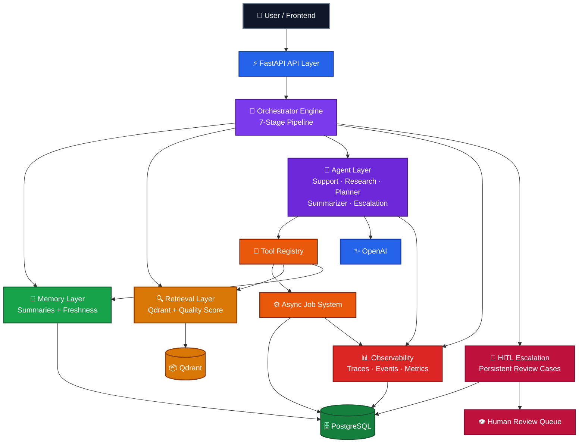

<div align="center">
  
</div>

<h1 align="center">Nexus AI</h1>

<h3 align="center">Production-grade Multi-Agent AI Orchestration System</h3>

<p align="center">
  <em>Not a chatbot — a full AI system that can think, act, and escalate</em>
</p>

<br/>

<p align="center">
  
  &nbsp;
  
  &nbsp;
  
  &nbsp;
  
  &nbsp;
  
  &nbsp;
  
</p>

<p align="center">
  
  &nbsp;
  
  &nbsp;
  
  &nbsp;
  
</p>

---

## What is Nexus AI?

Nexus AI is a **production-grade AI orchestration platform** — not a chatbot wrapper.

It is a fully architected AI system built around five specialized agents, a 7-stage orchestrator pipeline, persistent conversation memory, Qdrant-backed semantic retrieval, multi-step execution planning, a complete observability layer, and a human-in-the-loop review workflow for escalated cases.

The platform solves a harder problem than "how do I chat with an LLM?" — it asks:

> How do you build an AI system that **routes intelligently**, stays **grounded in retrieved knowledge**, **remembers the right things**, **traces every decision**, and **safely hands off to humans** when confidence is low or risk is high?

Nexus AI answers that question with real architecture, real tests, and a real production-ready backend.

---

## Core Capabilities

- **Multi-agent orchestration** — 5 specialized agents (support, research, planner, summarizer, escalation) routed through a 7-stage pipeline
- **Persistent memory** — conversation summaries with freshness scoring and context reuse across sessions
- **RAG with Qdrant** — vector-backed semantic retrieval with quality-scored context and adaptive response posture
- **LLM reasoning** — OpenAI-powered agent reasoning, planning, and answer generation grounded in retrieved context
- **Multi-step planning** — deterministic execution plans with dependency tracking, chaining, and skip logic
- **Async job system** — background ingestion, memory summarization, and analytics aggregation via a persistent job queue
- **Observability** — every request carries a trace ID, stage timings, enriched events, and a queryable metrics endpoint
- **Human-in-the-loop escalation** — low-confidence or high-risk requests become persistent DB-backed review cases
- **Customer report flow** — `/report` page lets customers submit issues that flow through the full AI pipeline
- **Auth & role protection** — JWT-based auth with reviewer and admin roles guarding all sensitive APIs

---

## Live System Flow

Here is what happens when a customer submits an issue through Nexus AI:

```
1.  Customer submits an issue via /report
        ↓
2.  Request enters the FastAPI backend → /api/v1/chat
        ↓
3.  Orchestrator runs the 7-stage pipeline
     ├── Stage 1: Resolve conversation + load memory
     ├── Stage 2: Retrieve context from Qdrant (RAG)
     ├── Stage 3: Build execution plan
     ├── Stage 4: Select agent (support / research / escalation / ...)
     ├── Stage 5: Execute agent with tools
     ├── Stage 6: Compose grounded response
     └── Stage 7: Log events, persist state, return result
        ↓
4.  AI evaluates confidence and intent
        ↓
5.  If urgent / high-risk → escalation agent triggered automatically
        ↓
6.  Escalation case created in PostgreSQL with severity, reason, and audit note
        ↓
7.  Human reviewer sees the case in the Escalation Dashboard
     └── Can assign, add notes, approve, reject, or resolve
```

---

## Features

### Customer Report UI

A public-facing `/report` page where customers can submit support issues without creating an account. Priority levels (`normal`, `high`, `urgent`, `critical`) control how the message is composed and routed — urgent and critical submissions automatically inject escalation signals into the AI pipeline.

- No auth required for customers
- Submits through the full multi-agent pipeline
- Urgent/critical issues auto-escalate and create a DB case
- Returns a real AI-generated response with escalation status

### Escalation Dashboard (HITL)

A protected reviewer dashboard at `/escalations` for managing human-in-the-loop review cases.

- Reviewer and admin roles enforced via JWT
- Filter cases by status, severity, and assignee
- Assign cases to specific reviewers
- Add internal notes (human or system type)
- Move cases through: `open → in_review → approved / rejected → resolved`
- Invalid status transitions rejected with 400 errors
- Full audit trail for every case action

### AI Pipeline

The core orchestration engine processes every request through a staged pipeline:

- Intent triage → agent selection → planning → tool execution → response composition
- 5 specialized agents with distinct roles and tool wiring
- Tool registry with structured invocation (retrieval, memory, escalation trigger)
- Retrieval quality signals (strong / weak / none) adjust response confidence
- Memory freshness heuristics determine when summaries are reused vs. refreshed
- Full pipeline state flows into every response payload

### Observability

Every execution leaves a complete trace:

- `X-Correlation-ID` and `X-Trace-ID` on every request
- Stage timings (per-stage latency breakdown)
- Enriched event log with agent, memory, retrieval, and escalation signals
- In-memory metrics snapshot at `/api/v1/observability/metrics`
- Trace lookup at `/api/v1/observability/trace/{trace_id}`
- Health and readiness endpoints for deployment monitoring

---

## UI Preview

### Report an Issue (`/report`)

The customer-facing issue submission form. No login required. Urgent and critical priority levels trigger automatic escalation routing.

```
┌─────────────────────────────────────────┐
│  Report an Issue                        │
│                                         │
│  Contact Reference  [________________]  │
│  Email              [________________]  │
│  Issue Title        [________________]  │
│  Description        [________________]  │
│                     [________________]  │
│  Priority           [ Normal ▾       ]  │
│                                         │
│           [ Submit Report ]             │
└─────────────────────────────────────────┘
```

### Escalation Queue (`/escalations`)

The reviewer dashboard for managing HITL cases. Protected by role-based auth — reviewers and admins only.

```
┌──────────────────────────────────────────────────────────────┐
│  Escalation Queue               [Status ▾] [Severity ▾]     │
│                                                              │
│  CASE-001  │  open    │  critical  │  user-42  │  Unassigned │
│  CASE-002  │  in_review│  high    │  user-19  │  reviewer-1 │
│  CASE-003  │  resolved │  medium  │  user-07  │  reviewer-2 │
└──────────────────────────────────────────────────────────────┘
```

### Case Detail (`/escalations/[caseId]`)

Drill into any case for the full audit trail — conversation context, escalation reason, assigned reviewer, status history, and human notes.

---

## Tech Stack

| Layer | Technology | Purpose |
|:---|:---|:---|
| Frontend | Next.js 14 | App router, server components, reviewer dashboard and report UI |
| Frontend | TypeScript | Type-safe components and API client |
| Frontend | Tailwind CSS | Utility-first styling across all pages |
| Backend | FastAPI | Async Python API with typed schemas and route groups |
| Backend | SQLAlchemy | ORM for conversations, events, jobs, escalation, and auth state |
| Database | PostgreSQL | Primary persistence for all structured platform data |
| Vector DB | Qdrant | Document indexing, embedding storage, and semantic retrieval |
| LLM | OpenAI | Agent reasoning, planning, summarization, and response generation |
| Auth | PyJWT | JWT-based authentication with role enforcement |
| Infra | Docker + Compose | Development and production container deployment |
| Frontend Deploy | Vercel | Auto-deploy from `main` with `vercel.json` build config |
| Backend Deploy | Hugging Face Spaces | Backend API hosted on HF Spaces |

---

## Architecture

Nexus AI is organized around a **backend-first orchestration core**. The API receives requests, the orchestrator manages execution scope, agents and tools produce grounded output, background jobs handle longer-running work, observability captures the full trail, and escalated cases move into a persistent human review workflow.



---

## Project Structure

```
nexus-ai/
├── backend/
│   ├── app/
│   │   ├── api/v1/         — Route handlers (chat, escalations, auth, observability, ...)
│   │   ├── services/       — Orchestrator, agents, memory, retrieval, tools, jobs
│   │   ├── db/             — Models, CRUD, migrations, PostgreSQL session
│   │   ├── schemas/        — Pydantic request/response models
│   │   ├── core/           — Config, logging, security, IDs
│   │   ├── workers/        — Background job workers
│   │   └── evals/          — Deterministic evaluation runner and benchmarks
│   ├── tests/              — 160+ backend tests (no live dependencies)
│   ├── eval_reports/       — Saved evaluation run outputs
│   └── requirements.txt
│
├── frontend/
│   ├── app/
│   │   ├── page.tsx        — Home
│   │   ├── report/         — Customer issue report UI
│   │   ├── escalations/    — Reviewer dashboard + case detail
│   │   └── login/          — Auth page
│   ├── components/         — UI components (forms, dashboard, cards, auth)
│   ├── lib/                — API client, auth helpers, escalation + report logic
│   └── types/              — Shared TypeScript types
│
├── docs/                   — Architecture, API contracts, deployment, dev status
├── specs/                  — Phase implementation specs
├── docker-compose.yml
├── docker-compose.prod.yml
└── vercel.json
```

---

## Environment Variables

| Variable | Required | Description |
|:---|:---:|:---|
| `DATABASE_URL` | ✅ | PostgreSQL connection string |
| `QDRANT_URL` | ✅ | Qdrant instance URL |
| `OPENAI_API_KEY` | ✅ | OpenAI API key for LLM inference |
| `JWT_SECRET_KEY` | ✅ | Secret key for JWT token signing |
| `APP_ENV` | — | Environment name (`development` / `production`) |
| `APP_VERSION` | — | Version string included in API responses |
| `CORS_ALLOWED_ORIGINS` | — | Comma-separated list of allowed origins |
| `ENABLE_ASYNC_MEMORY_SUMMARY` | — | Queue summaries async instead of inline (default: `false`) |

Frontend:

| Variable | Description |
|:---|:---|
| `NEXT_PUBLIC_API_BASE_URL` | Backend API base URL (e.g. `http://localhost:8000`) |
| `INTERNAL_API_BASE_URL` | Server-side API URL for SSR requests (optional, defaults to above) |

---

## System Status

| Component | Status |
|:---|:---:|
| AI Orchestration Pipeline | ✅ Active |
| Persistent Memory Layer | ✅ Active |
| RAG / Qdrant Retrieval | ✅ Active |
| Multi-step Planning Engine | ✅ Active |
| 5-Agent Execution Layer | ✅ Active |
| Tool Registry | ✅ Active |
| Async Background Jobs | ✅ Active |
| Observability + Tracing | ✅ Active |
| HITL Escalation Workflow | ✅ Active |
| Customer Report Flow | ✅ Active |
| Auth & Role Protection | ✅ Active |
| Docker / CI Deployment | ✅ Ready |

---

## Why This Is Not Just a Chatbot

Most "AI apps" are a prompt sent to an LLM with a response displayed. Nexus AI is an engineered system:

**Routing is real.** Every message passes through a triage stage that selects the right agent based on intent signals — not a single monolithic prompt.

**Memory is persistent.** Conversations accumulate summaries. Every new request knows what was said before, how fresh that context is, and whether it should be trusted.

**Retrieval is grounded.** Answers are built from indexed knowledge, not hallucinated. Retrieval quality is scored — weak results change how the system responds.

**Planning is explicit.** Complex requests expand into multi-step execution plans with dependency tracking. You can inspect what the AI decided to do and why.

**Escalation is a workflow, not a flag.** When the system lacks confidence or detects high risk, it doesn't silently fail — it creates a persistent case, assigns it, and routes it to a human reviewer with a full audit trail.

**Observability is first-class.** Every request produces a trace. Stage timings, agent decisions, memory signals, retrieval signals, tool calls, and escalation events are all captured and queryable.

This is AI + workflow + system design — built to the standard of a real production platform.

---

## Quick Start

### 1. Clone and configure

```bash
git clone <repo-url> nexus-ai
cd nexus-ai
cp backend/.env.example backend/.env
# Fill in DATABASE_URL, QDRANT_URL, OPENAI_API_KEY, JWT_SECRET_KEY
```

### 2. Install backend dependencies

```bash
cd backend
python -m venv .venv
source .venv/bin/activate   # Windows: .venv\Scripts\activate
pip install -r requirements.txt
```

### 3. Start infrastructure and backend

```bash
docker compose up -d        # starts PostgreSQL + Qdrant
uvicorn app.main:app --reload --port 8000
```

Development seeded accounts:

| Role | Email | Password |
|:---|:---|:---|
| Reviewer | `reviewer@nexus.local` | `ReviewerPass123!` |
| Admin | `admin@nexus.local` | `AdminPass123!` |

### 4. Start the frontend

```bash
cd ../frontend
npm install
cp .env.local.example .env.local
# Set NEXT_PUBLIC_API_BASE_URL=http://localhost:8000
npm run dev
```

Open `http://localhost:3000` — report page at `/report`, reviewer dashboard at `/escalations`.

### 5. Verify the platform

```bash
curl http://localhost:8000/api/v1/health
```

---

## Testing

The full backend test suite runs without live OpenAI, Qdrant, or PostgreSQL dependencies — all external calls are mocked or use an in-memory SQLite database.

```bash
cd backend
.venv/Scripts/python -m pytest tests/ -q
```

- **160 tests passing** across 14 test files
- Covers orchestration, planning, memory, retrieval quality, agents, tools, escalation lifecycle, jobs, observability, auth, and evals
- Fast, deterministic, no external services required

---

## Evaluation Suite

```bash
cd backend
.venv/Scripts/python -m app.evals.runner --suite all --save-report
```

- **18 / 18** benchmark cases passing
- Covers agent selection, retrieval quality, memory quality, and regression stability
- Reports saved to `backend/eval_reports/`

---

## Deployment

### Development

```bash
docker compose up --build
```

### Production

```bash
docker compose -f docker-compose.yml -f docker-compose.prod.yml up --build -d
```

### Frontend — Vercel

The `vercel.json` at the repository root handles the build configuration automatically.

1. Import the GitHub repository at [vercel.com](https://vercel.com)
2. Set environment variables in Vercel project settings:

   | Variable | Value |
   |:---|:---|
   | `NEXT_PUBLIC_API_BASE_URL` | `https://zohairazmat-nexus-ai-orchestrator.hf.space` |

3. Deploy — Vercel auto-redeploys on every push to `main`

---

## Development Progress

| Phase | Scope | Status |
|:---:|:---|:---:|
| 1 | Foundation — API scaffolding, project structure, base orchestrator | ✅ Complete |
| 2 | Database + RAG — PostgreSQL, Qdrant, ingestion, retrieval | ✅ Complete |
| 3 | Agents + LLM + Tools — multi-agent routing, tool execution | ✅ Complete |
| 4 | Async Jobs + Observability — background jobs, tracing, metrics | ✅ Complete |
| 5 | Planning + Intelligence — multi-step execution, quality signals | ✅ Complete |
| 6 | Production Features — HITL workflow, dashboard, auth, eval suite | ✅ Complete |
| 7 | Deployment + Polish — Docker, CI/CD, health endpoints, customer UI | ✅ Complete |

---

## Documentation

| Resource | Description |
|:---|:---|
| [backend/README.md](backend/README.md) | Backend setup, environment variables, API groups, test commands |
| [docs/architecture.md](docs/architecture.md) | Detailed architecture decisions and design rationale |
| [docs/api-contracts.md](docs/api-contracts.md) | API schema and contract reference |
| [docs/deployment.md](docs/deployment.md) | Deployment and production configuration guide |
| [docs/dev-status.md](docs/dev-status.md) | Current implementation snapshot |

---

<p align="center">
  Built by <strong>Zohair Azmat</strong> &nbsp;·&nbsp; AI Engineer | Full Stack Developer
</p>

<p align="center">
  <sub>MIT License</sub>
</p>
