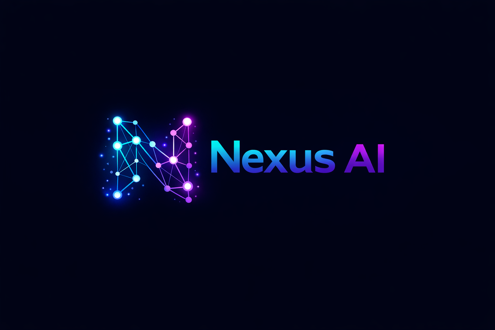
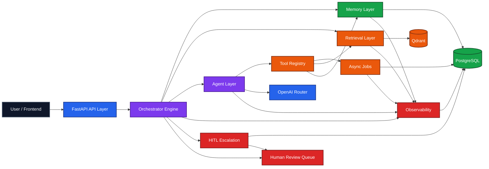

<p align="center">
  
</p>

<h1 align="center">Nexus AI</h1>

<p align="center">
  <b>By Zohair Azmat</b>
</p>

<p align="center">
  AI Engineer | Full Stack Developer
</p>

<p align="center">
  <strong>Multi-Agent RAG Orchestration Platform</strong>
</p>

<p align="center">
  Nexus AI is a production-style AI platform for memory-aware conversations, grounded retrieval, multi-step planning, observability, async jobs, and human-in-the-loop escalation.
</p>

<p align="center">
  
  
  
  
  
</p>

<p align="center">
  
  
  
  
  
</p>

## Overview

Nexus AI is an advanced AI orchestration platform, not a simple chatbot wrapper. The repository combines a staged FastAPI orchestrator, memory and retrieval systems, specialized agents, tool-assisted execution, background jobs, observability, and an emerging human review workflow into a single backend-first operating layer for serious AI applications.

The project exists to answer a harder question than "how do we chat with an LLM?" It asks how to build an AI system that can route intelligently, stay grounded, remember the right things, expose traceable execution, recover safely when confidence is weak, and hand off to humans when risk is high.

## Why This Project Exists

- Most AI demos stop at prompt wiring. Nexus AI is built around orchestration, persistence, auditability, and extensibility.
- Real-world AI systems need memory freshness, retrieval quality control, tool-aware planning, async work, and production observability.
- Escalation and review matter. Nexus AI is moving toward a full human-in-the-loop operating model rather than pretending every answer should be fully autonomous.

## Current Capabilities

- Multi-stage orchestration pipeline with intake, memory, retrieval, triage, planning, response, escalation, and event logging.
- Specialized agents for support, research, summarization, planning, and escalation.
- Multi-step execution plans with deterministic chaining, tool recommendations, dependency tracking, and skip logic.
- Retrieval quality assessment with compacted context, strong/weak/none grounding signals, and memory-aware retrieval skipping.
- Memory freshness heuristics with summary reuse, recent-turn prioritization, and refresh recommendation signals.
- Async job system for ingestion, analytics, and memory summary workflows.
- Internal observability with traces, stage timings, metrics, and event enrichment.
- Human-in-the-loop escalation workflow with persistent cases, notes, assignment, status changes, and audit events.
- Reviewer/admin authentication with protected reviewer APIs and a frontend login flow.
- Deterministic evaluation suites for retrieval quality, memory quality, agent selection, and regression stability.
- Production readiness improvements for environment validation, Docker deployment, CI, and readiness checks.

## Architecture Summary

Nexus AI is organized around a backend-first orchestration core. The API receives requests, the orchestrator decides how much context and execution is needed, agents and tools produce grounded output, background jobs handle longer-running work, observability captures the full trail, and escalated cases can move into a persistent human review workflow.



## Key Features

- Deterministic planning: simple requests stay single-step while complex requests expand into explainable multi-step plans.
- Context discipline: retrieval and memory are filtered, compacted, and routed intentionally instead of dumping raw context everywhere.
- Grounded response behavior: confidence and answer posture adapt to retrieval quality and memory freshness.
- Production-style visibility: traces, metrics, enriched events, and stage timings are built into the execution path.
- HITL-ready operations: escalations now become persistent review cases rather than transient runtime signals.

## Backend Highlights

- FastAPI service with modular route groups and typed schemas.
- SQLAlchemy-backed persistence for conversations, summaries, events, jobs, and escalation workflow state.
- Orchestrator engine with isolated stages and shared execution context.
- Service modules for agents, memory, retrieval, tools, jobs, observability, analytics, and escalation management.
- Clean extension path for future dashboard, reviewer operations, and production deployment hardening.

## Observability Highlights

- `trace_id` and correlation flow through requests, jobs, agents, tools, and escalation paths.
- Enriched event model with stage, component, latency, status, and execution metadata.
- Trace and metrics endpoints for operational inspection without external observability dependencies.
- Planning, retrieval quality, memory freshness, grounding mode, jobs, and escalation events are all auditable.

## Planning, Tools, and Jobs

- Planner supports deterministic agent chaining and context-aware step creation.
- Tool planning can recommend or skip work based on retrieval quality and available memory.
- Async jobs support document ingestion, memory summarization, and analytics aggregation.
- Tool calls and job execution remain observable and testable without requiring live external services.

## Project Structure

```text
backend/
  app/
  evals/
  evals_data/
  tests/

frontend/
  app/
  components/
  lib/
  public/

docs/
  architecture.md
  api-contracts.md
  deployment.md
  dev-status.md

specs/
prompt_history/
docker-compose.yml
docker-compose.prod.yml
```

## Testing

The backend test suite is designed to run without live OpenAI, Qdrant, or PostgreSQL dependencies. The current repository state includes:

- `160` backend tests passing.
- Coverage for orchestration, planning, retrieval quality, memory freshness, jobs, observability, tools, and escalation workflow.
- In-memory and mocked test paths that keep development fast and deterministic.

```bash
cd backend
pytest tests -q
```

## Quick Start

### 1. Clone and configure

```bash
git clone <repo-url> nexus-ai
cd nexus-ai
cp backend/.env.example backend/.env
```

### 2. Install backend dependencies

```bash
cd backend
python -m venv .venv
.venv\Scripts\activate
pip install -r requirements.txt
```

### 3. Start infrastructure and backend

```bash
docker compose up -d
uvicorn app.main:app --reload --port 8000
```

In development, the backend bootstraps these accounts automatically:

- `reviewer@nexus.local` / `ReviewerPass123!`
- `admin@nexus.local` / `AdminPass123!`

### 4. Start the frontend

```bash
cd ../frontend
npm install
copy .env.local.example .env.local
npm run dev
```

Set `NEXT_PUBLIC_API_BASE_URL` in `frontend/.env.local` if your backend is not running on `http://localhost:8000`.
For containerized Next.js deployments, you can also set `INTERNAL_API_BASE_URL` so server-side requests use an internal backend hostname while browsers keep using the public API URL.

### 5. Verify the platform

```bash
curl http://localhost:8000/api/v1/health
```

### 6. Sign in to the reviewer dashboard

Open `http://localhost:3000/login` and sign in with one of the development accounts above.

### 7. Run the evaluation suite

```bash
cd backend
.venv\Scripts\python.exe -m app.evals.runner --suite all --save-report
```

Reports are saved under `backend/eval_reports/`.

### 8. Run with Docker

```bash
docker compose up --build
```

For a production-oriented override:

```bash
docker compose -f docker-compose.yml -f docker-compose.prod.yml up --build -d
```

Backend-specific environment and runtime details live in [backend/README.md](backend/README.md).

## Roadmap and Current Status

- Completed through Phase 5 Step 3: retrieval and memory quality optimization.
- Completed through Phase 7: production deployment polish and readiness.
- Next maturity direction: broader HITL tooling, release automation, and continued hardening of orchestration and observability.

For the latest implementation snapshot, see [docs/dev-status.md](docs/dev-status.md). Deployment-specific setup and cloud guidance are in [docs/deployment.md](docs/deployment.md).

## Backend Documentation

The root README is the main GitHub showcase and project overview. The backend-only setup, environment variables, API group summary, and test commands are documented in [backend/README.md](backend/README.md).

## License

MIT
