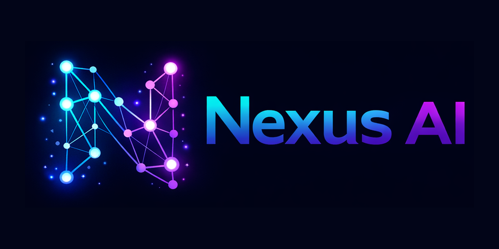
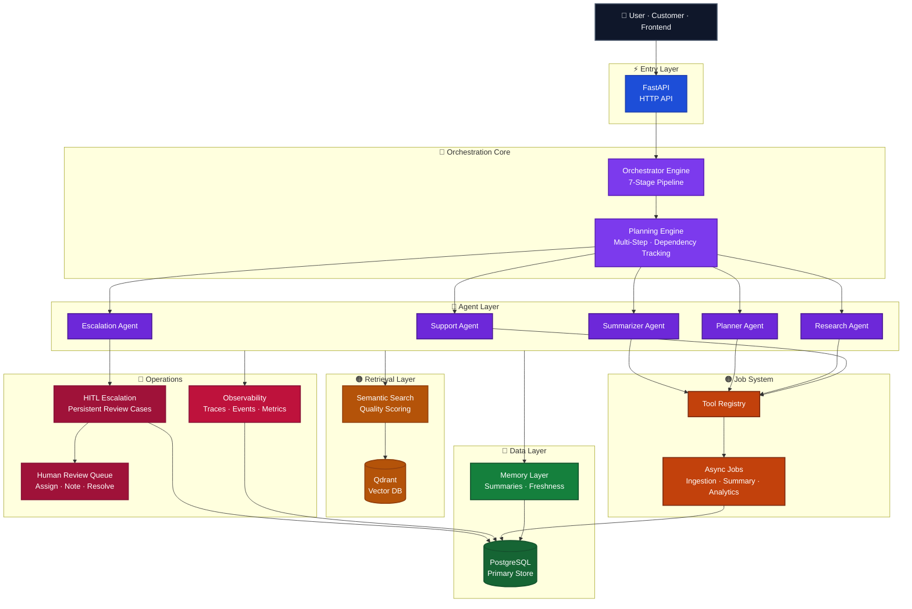

<div align="center">
  
</div>

<br/>

<div align="center">

# Nexus AI

### Production-grade Multi-Agent AI Orchestration System

*Not a chatbot — a full AI system that can think, act, and escalate*

</div>

<br/>

<div align="center">

<!-- Tech stack -->


<!-- Deployment -->


<!-- Quality -->


</div>

---

<div align="center">

| 🤖 5 Specialized Agents | 🔄 7-Stage Pipeline | 💾 Persistent Memory | 🔍 RAG + Qdrant |
|:---:|:---:|:---:|:---:|
| **⚡ Async Job System** | **📊 Full Observability** | **🚨 HITL Escalation** | **🔐 JWT Auth + Roles** |

</div>

---

## What is Nexus AI?

Nexus AI is a **production-grade AI orchestration platform** — not a chatbot wrapper.

It is a fully architected AI system built around five specialized agents, a 7-stage orchestrator pipeline, persistent conversation memory, Qdrant-backed semantic retrieval, multi-step execution planning, a complete observability layer, and a human-in-the-loop review workflow for escalated cases.

The platform answers a harder question than *"how do I chat with an LLM?"*:

> 💡 How do you build an AI system that **routes intelligently**, stays **grounded in retrieved knowledge**, **remembers the right things**, **traces every decision**, and **safely escalates to humans** when confidence is low or risk is high?

Nexus AI answers that with real architecture, real tests, and a real production-ready backend.

---

## System Snapshot

<div align="center">

| Metric | Value |
|:---|:---:|
| 🧪 Backend tests | **160 passing** |
| 📐 Eval benchmarks | **18 / 18** |
| 🤖 Specialized agents | **5 active** |
| 🔄 Pipeline stages | **7** |
| 📁 Test files | **14** |
| 🚀 Build phases | **7 / 7 complete** |
| 💬 Chat → escalation | **automatic** |
| 🌐 Deployment targets | **Vercel + HF Spaces** |

</div>

---

## Core Capabilities

<div align="center">

| Capability | What It Does |
|:---|:---|
| 🤖 **Multi-agent orchestration** | 5 agents (support, research, planner, summarizer, escalation) routed through a 7-stage pipeline |
| 💾 **Persistent memory** | Conversation summaries with freshness scoring and context reuse across sessions |
| 🔍 **RAG with Qdrant** | Vector-backed semantic retrieval with quality-scored context and adaptive response posture |
| ✨ **LLM reasoning** | OpenAI-powered agent reasoning, planning, and answer generation grounded in retrieved context |
| 🗺️ **Multi-step planning** | Deterministic execution plans with dependency tracking, chaining, and skip logic |
| ⚙️ **Async job system** | Background ingestion, memory summarization, and analytics aggregation via a persistent job queue |
| 📊 **Full observability** | Every request carries a trace ID, stage timings, enriched events, and a queryable metrics endpoint |
| 🚨 **HITL escalation** | Low-confidence or high-risk requests become persistent DB-backed human review cases |
| 📋 **Customer report flow** | `/report` page submits issues through the full AI pipeline — no auth required |
| 🔐 **Auth & roles** | JWT-based auth with reviewer and admin roles guarding all sensitive APIs |

</div>

---

## Live System Flow

```
  ┌─────────────────────────────────────────────────────────────────┐
  │                      NEXUS AI REQUEST FLOW                      │
  └─────────────────────────────────────────────────────────────────┘

  1.  👤  Customer submits an issue via /report
              ↓
  2.  ⚡  Request enters FastAPI backend → POST /api/v1/chat
              ↓
  3.  🧠  Orchestrator runs the 7-stage pipeline
       ├── Stage 1 ── Resolve conversation + load persistent memory
       ├── Stage 2 ── Retrieve context from Qdrant (RAG)
       ├── Stage 3 ── Build multi-step execution plan
       ├── Stage 4 ── Select agent: support / research / escalation / ...
       ├── Stage 5 ── Execute agent with tool registry
       ├── Stage 6 ── Compose grounded, quality-scored response
       └── Stage 7 ── Log events, persist state, emit trace
              ↓
  4.  🎯  AI evaluates confidence and intent signals
              ↓
  5.  🚨  If urgent / high-risk → escalation agent triggered automatically
              ↓
  6.  🗄️  Escalation case created in PostgreSQL (severity + reason + audit note)
              ↓
  7.  👁️  Human reviewer sees the case in the Escalation Dashboard
       └── Assign · Add notes · Approve · Reject · Resolve
```

---

## Features

### 📋 Customer Report UI

A public-facing `/report` page for customers to submit support issues without creating an account. Priority levels (`normal` `high` `urgent` `critical`) control routing — urgent and critical submissions automatically inject escalation signals.

| Detail | Value |
|:---|:---|
| Auth required | ❌ None — public access |
| Pipeline path | Full 7-stage multi-agent pipeline |
| Escalation | Auto-triggered on urgent / critical priority |
| Response | Real AI-generated answer + escalation status |

---

### 🚨 Escalation Dashboard (HITL)

A protected reviewer dashboard at `/escalations` for managing human-in-the-loop review cases. Reviewers and admins only.

| Capability | Detail |
|:---|:---|
| Case filtering | By status, severity, and assignee |
| Assignment | Route cases to specific reviewers |
| Notes | Human and system note types with timestamps |
| Status flow | `open → in_review → approved / rejected → resolved` |
| Invalid transitions | Rejected with `400` — no silent state corruption |
| Audit trail | Every action is logged and traceable |

---

### 🤖 AI Pipeline

The orchestration engine processes every request through a 7-stage pipeline:

| Stage | Role |
|:---|:---|
| Intake | Resolve conversation, load memory, apply freshness heuristics |
| Retrieval | Qdrant semantic search with quality scoring (strong / weak / none) |
| Planning | Generate deterministic single- or multi-step execution plan |
| Agent selection | Triage routes to support, research, planner, summarizer, or escalation |
| Tool execution | Structured tool invocation via Tool Registry (retrieval, memory, escalation) |
| Response | Compose grounded answer with confidence signals |
| Observability | Emit enriched trace events, persist state, return full pipeline payload |

---

### 📊 Observability

Every execution leaves a complete, queryable trace.

| Signal | Endpoint / Detail |
|:---|:---|
| Correlation + Trace ID | `X-Correlation-ID` and `X-Trace-ID` on every response |
| Stage timings | Per-stage latency breakdown in every response payload |
| Event log | Agent, memory, retrieval, escalation signals per request |
| Metrics | `GET /api/v1/observability/metrics` |
| Trace lookup | `GET /api/v1/observability/trace/{trace_id}` |
| Health | `GET /api/v1/health` · `GET /api/v1/ready` |

---

## UI Preview

### `/report` — Customer Issue Form

```
  ╔═══════════════════════════════════════════════════╗
  ║  📋  Report an Issue                              ║
  ╠═══════════════════════════════════════════════════╣
  ║  Contact Reference  ┌──────────────────────────┐  ║
  ║                     └──────────────────────────┘  ║
  ║  Email              ┌──────────────────────────┐  ║
  ║                     └──────────────────────────┘  ║
  ║  Issue Title        ┌──────────────────────────┐  ║
  ║                     └──────────────────────────┘  ║
  ║  Description        ┌──────────────────────────┐  ║
  ║                     │                          │  ║
  ║                     └──────────────────────────┘  ║
  ║  Priority           ┌──────────────────────────┐  ║
  ║                     │  Normal            ▾     │  ║
  ║                     └──────────────────────────┘  ║
  ║                                                   ║
  ║              ██████  Submit Report  ██████         ║
  ╚═══════════════════════════════════════════════════╝
```

### `/escalations` — Reviewer Dashboard

```
  ╔══════════════════════════════════════════════════════════════════╗
  ║  🚨  Escalation Queue           [Status ▾]  [Severity ▾]        ║
  ╠══════════════════════════════════════════════════════════════════╣
  ║  CASE-001  │  🔴 open      │  critical │  user-42 │  Unassigned  ║
  ║  CASE-002  │  🟡 in_review │  high     │  user-19 │  reviewer-1  ║
  ║  CASE-003  │  🟢 resolved  │  medium   │  user-07 │  reviewer-2  ║
  ╚══════════════════════════════════════════════════════════════════╝
```

### `/escalations/[caseId]` — Case Detail

Full audit trail view: conversation context, escalation reason, assigned reviewer, status history, and internal notes — all in one place.

---

## Architecture

Nexus AI is organized around a **backend-first orchestration core**. The API receives requests, the orchestrator manages execution scope, agents and tools produce grounded output, background jobs handle longer-running work, observability captures the full trail, and escalated cases flow into persistent human review.



---

## Tech Stack

| Layer | Technology | Role |
|:---|:---|:---|
| 🖥️ Frontend | **Next.js 14** | App router, server components, reviewer dashboard and report UI |
| 🖥️ Frontend | **TypeScript** | Type-safe components and API client |
| 🖥️ Frontend | **Tailwind CSS** | Utility-first styling across all pages |
| ⚡ Backend | **FastAPI** | Async Python API with typed schemas and route groups |
| ⚡ Backend | **SQLAlchemy** | ORM for conversations, events, jobs, escalation, and auth state |
| 🗄️ Database | **PostgreSQL** | Primary persistence for all structured platform data |
| 🔍 Vector DB | **Qdrant** | Document indexing, embedding storage, and semantic retrieval |
| ✨ LLM | **OpenAI** | Agent reasoning, planning, summarization, and response generation |
| 🔐 Auth | **PyJWT** | JWT-based authentication with role enforcement |
| 🐳 Infra | **Docker + Compose** | Development and production container deployment |
| 🌐 Deploy | **Vercel** | Frontend auto-deploy from `main` via `vercel.json` |
| 🤗 Deploy | **Hugging Face Spaces** | Backend API hosted as a Docker Space |

---

## Project Structure

```
nexus-ai/
├── backend/
│   ├── app/
│   │   ├── api/v1/         ─ Chat, escalations, auth, observability, health, jobs
│   │   ├── services/       ─ Orchestrator, agents, memory, retrieval, tools, jobs
│   │   ├── db/             ─ Models, CRUD, migrations, PostgreSQL session management
│   │   ├── schemas/        ─ Pydantic request / response models
│   │   ├── core/           ─ Config, logging, security, correlation IDs
│   │   ├── workers/        ─ Background job workers
│   │   └── evals/          ─ Deterministic evaluation runner + 18 benchmarks
│   ├── tests/              ─ 160 tests across 14 files (no live deps)
│   ├── eval_reports/       ─ Saved evaluation run outputs
│   └── requirements.txt
│
├── frontend/
│   ├── app/
│   │   ├── page.tsx        ─ Home
│   │   ├── report/         ─ Customer issue report UI (public)
│   │   ├── escalations/    ─ Reviewer dashboard + case detail
│   │   └── login/          ─ Auth page
│   ├── components/         ─ Forms, dashboard, cards, auth components
│   ├── lib/                ─ API client, auth helpers, escalation + report logic
│   └── types/              ─ Shared TypeScript types
│
├── docs/                   ─ Architecture, API contracts, deployment, dev status
├── specs/                  ─ Phase implementation specs
├── docker-compose.yml
├── docker-compose.prod.yml
└── vercel.json
```

---

## Environment Variables

**Backend (`backend/.env`)**

| Variable | Required | Description |
|:---|:---:|:---|
| `DATABASE_URL` | ✅ | PostgreSQL connection string |
| `QDRANT_URL` | ✅ | Qdrant instance URL |
| `OPENAI_API_KEY` | ✅ | OpenAI API key for LLM inference |
| `JWT_SECRET_KEY` | ✅ | Secret key for JWT token signing |
| `APP_ENV` | — | `development` or `production` |
| `CORS_ALLOWED_ORIGINS` | — | Comma-separated list of allowed origins |
| `ENABLE_ASYNC_MEMORY_SUMMARY` | — | Queue memory summaries async (default: `false`) |

**Frontend (`frontend/.env.local`)**

| Variable | Description |
|:---|:---|
| `NEXT_PUBLIC_API_BASE_URL` | Backend API base URL (e.g. `http://localhost:8000`) |
| `INTERNAL_API_BASE_URL` | Server-side API URL for SSR — defaults to above if unset |

---

## System Status

<div align="center">

| Component | Status |
|:---|:---:|
| 🧠 AI Orchestration Pipeline (7 stages) | ✅ Active |
| 💾 Persistent Memory + Freshness Scoring | ✅ Active |
| 🔍 RAG / Qdrant Semantic Retrieval | ✅ Active |
| 🗺️ Multi-step Planning Engine | ✅ Active |
| 🤖 5-Agent Execution Layer | ✅ Active |
| 🔧 Tool Registry | ✅ Active |
| ⚙️ Async Background Job System | ✅ Active |
| 📊 Observability + Tracing | ✅ Active |
| 🚨 HITL Escalation Workflow | ✅ Active |
| 📋 Customer Report Flow (`/report`) | ✅ Active |
| 🔐 Auth + Role Protection | ✅ Active |
| 🐳 Docker + CI/CD Pipeline | ✅ Ready |

</div>

---

## Why This Is Not Just a Chatbot

Most "AI apps" are a prompt sent to an LLM with a response displayed. Nexus AI is an engineered system:

> **Routing is real.**
> Every message passes through a triage stage that selects the right agent based on intent signals — not a single monolithic prompt.

> **Memory is persistent.**
> Conversations accumulate summaries. Every new request knows what was said before, how fresh that context is, and whether it should be trusted.

> **Retrieval is grounded.**
> Answers are built from indexed knowledge, not hallucinated. Retrieval quality is scored — weak results change how the system responds.

> **Planning is explicit.**
> Complex requests expand into multi-step execution plans with dependency tracking. You can inspect what the AI decided to do and why.

> **Escalation is a workflow, not a flag.**
> When confidence is low or risk is high, the system creates a persistent case, assigns it, and routes it to a human reviewer — with a full audit trail.

> **Observability is first-class.**
> Every request produces a trace. Stage timings, agent decisions, memory signals, retrieval signals, tool calls, and escalation events are all captured and queryable.

**This is AI + workflow + system design — built to the standard of a real production platform.**

---

## Quick Start

### 1. Clone and configure

```bash
git clone <repo-url> nexus-ai
cd nexus-ai
cp backend/.env.example backend/.env
# Set DATABASE_URL, QDRANT_URL, OPENAI_API_KEY, JWT_SECRET_KEY
```

### 2. Install backend dependencies

```bash
cd backend
python -m venv .venv
source .venv/bin/activate       # Windows: .venv\Scripts\activate
pip install -r requirements.txt
```

### 3. Start infrastructure and backend

```bash
docker compose up -d            # starts PostgreSQL + Qdrant
uvicorn app.main:app --reload --port 8000
```

Seeded development accounts:

| Role | Email | Password |
|:---|:---|:---|
| Reviewer | `reviewer@nexus.local` | `ReviewerPass123!` |
| Admin | `admin@nexus.local` | `AdminPass123!` |

### 4. Start the frontend

```bash
cd ../frontend
npm install && cp .env.local.example .env.local
# Set NEXT_PUBLIC_API_BASE_URL=http://localhost:8000
npm run dev
```

Open `http://localhost:3000` — customer report at `/report`, reviewer dashboard at `/escalations`.

### 5. Verify

```bash
curl http://localhost:8000/api/v1/health
```

---

## Testing

The full test suite runs without live OpenAI, Qdrant, or PostgreSQL dependencies.

```bash
cd backend
.venv/Scripts/python -m pytest tests/ -q
```

- **160 tests** across 14 files — orchestration, planning, memory, retrieval, agents, tools, escalation, jobs, observability, auth, evals
- In-memory SQLite per test — fast, deterministic, no external services required

---

## Evaluation Suite

```bash
cd backend
.venv/Scripts/python -m app.evals.runner --suite all --save-report
```

- **18 / 18** benchmark cases — agent selection, retrieval quality, memory quality, regression stability
- Reports saved to `backend/eval_reports/`

---

## Deployment

### Docker (Development)

```bash
docker compose up --build
```

### Docker (Production)

```bash
docker compose -f docker-compose.yml -f docker-compose.prod.yml up --build -d
```

### Frontend — Vercel

The `vercel.json` at repo root handles the build config automatically.

1. Import the repo at [vercel.com](https://vercel.com)
2. Add environment variable: `NEXT_PUBLIC_API_BASE_URL` → `https://zohairazmat-nexus-ai-orchestrator.hf.space`
3. Deploy — Vercel auto-redeploys on every push to `main`

---

## Development Progress

<div align="center">

| Phase | Scope | Status |
|:---:|:---|:---:|
| **1** | Foundation — API scaffolding, project structure, base orchestrator | ✅ Complete |
| **2** | Database + RAG — PostgreSQL, Qdrant, ingestion, retrieval | ✅ Complete |
| **3** | Agents + LLM + Tools — multi-agent routing, tool execution | ✅ Complete |
| **4** | Async Jobs + Observability — background jobs, tracing, metrics | ✅ Complete |
| **5** | Planning + Intelligence — multi-step execution, quality signals | ✅ Complete |
| **6** | Production Features — HITL workflow, dashboard, auth, eval suite | ✅ Complete |
| **7** | Deployment + Polish — Docker, CI/CD, health endpoints, customer UI | ✅ Complete |

</div>

---

## Documentation

| Resource | Description |
|:---|:---|
| [backend/README.md](backend/README.md) | Backend setup, env vars, API groups, test commands |
| [docs/architecture.md](docs/architecture.md) | Detailed architecture decisions and design rationale |
| [docs/api-contracts.md](docs/api-contracts.md) | API schema and contract reference |
| [docs/deployment.md](docs/deployment.md) | Deployment and production configuration guide |
| [docs/dev-status.md](docs/dev-status.md) | Current implementation snapshot |

---

<div align="center">

Built by **Zohair Azmat** · AI Engineer | Full Stack Developer

<sub>MIT License</sub>

</div>
